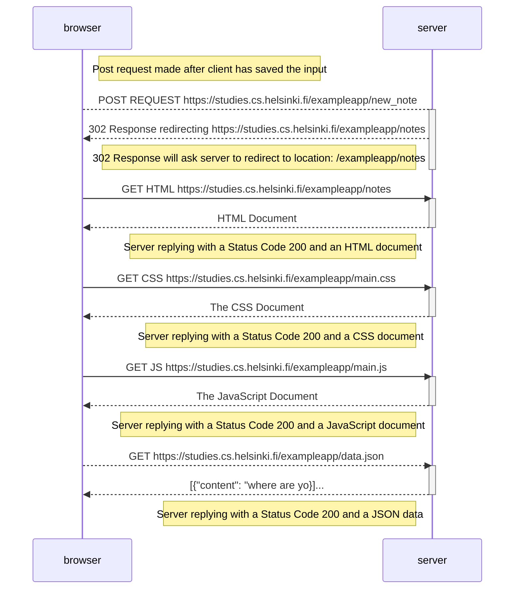

## Part 0 - 0.4: New note diagram

```mermaid

sequenceDiagram
participant browser
participant server
Note right of browser: Post request made after client has saved the input
browser-->server: POST REQUEST https://studies.cs.helsinki.fi/exampleapp/new_note
activate server
    server-->>browser: 302 Response redirecting https://studies.cs.helsinki.fi/exampleapp/notes
    Note left of server: 302 Response will ask server to redirect to location: /exampleapp/notes
deactivate server

browser->>server: GET HTML https://studies.cs.helsinki.fi/exampleapp/notes
activate server
server-->>browser: HTML Document
deactivate server
Note left of server: Server replying with a Status Code 200 and an HTML document
browser->>server: GET CSS https://studies.cs.helsinki.fi/exampleapp/main.css
activate server
server-->>browser: The CSS Document
deactivate server
Note left of server: Server replying with a Status Code 200 and a CSS document
browser->>server: GET JS https://studies.cs.helsinki.fi/exampleapp/main.js
activate server
server-->>browser: The JavaScript Document
deactivate server
Note left of server: Server replying with a Status Code 200 and a JavaScript document

browser-->>server: GET https://studies.cs.helsinki.fi/exampleapp/data.json
activate server
server-->>browser: [{"content": "where are yo}]...
deactivate server
Note left of server: Server replying with a Status Code 200 and a JSON data


```

