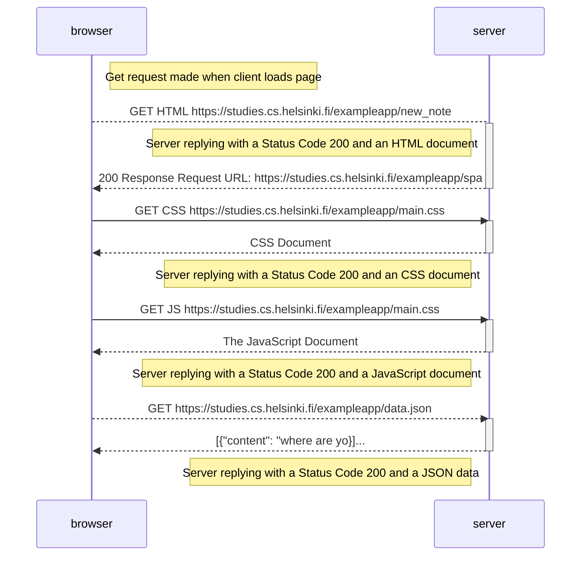

## Part 0 - 0.5: Single page app diagram

```mermaid

sequenceDiagram
participant browser
participant server
Note right of browser: Get request made when client loads page
browser-->server: GET HTML https://studies.cs.helsinki.fi/exampleapp/new_note
activate server
    Note left of server: Server replying with a Status Code 200 and an HTML document
    server-->>browser: 200 Response Request URL: https://studies.cs.helsinki.fi/exampleapp/spa
deactivate server

browser->>server: GET CSS https://studies.cs.helsinki.fi/exampleapp/main.css
activate server
server-->>browser: CSS Document
deactivate server
Note left of server: Server replying with a Status Code 200 and an CSS document
browser->>server: GET JS https://studies.cs.helsinki.fi/exampleapp/main.css
activate server
server-->>browser: The JavaScript Document
deactivate server
Note left of server: Server replying with a Status Code 200 and a JavaScript document


browser-->>server: GET https://studies.cs.helsinki.fi/exampleapp/data.json
activate server
server-->>browser: [{"content": "where are yo}]...
deactivate server
Note left of server: Server replying with a Status Code 200 and a JSON data


```

